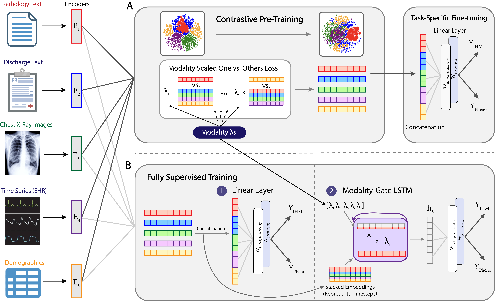

# PiCME: Pipeline for Contrastive Modality Evaluate and Encoding

Code for the paper: "PiCME: Pipeline for Contrastive Modality Evaluation and Encoding in the MIMIC Dataset". <br>

Contact `pranav_mahableshwarkar@brown.edu`, `michal_golovanevsky@brown.edu`, or `ritambhara@brown.edu` if you have any questions. <br>


## Description

We present a Pipeline for Contrastive Modality Evaluation and Encoding (PiCME), a scalable framework for contrastive learning across all 26 modality combinations in MIMIC-IV/CXR, providing insights into optimal modality selection and training strategies. To address performance plateaus with more modalities in both contrastive and fully-supervised settings, we introduce a Modality-Gated LSTM that weights modalities according to their contrastively learned importance. The figure below demonstrates our framework:



## Requirements
To install requirements:

```setup
pip install -r requirements.txt
```
## Preprocessing

## Contrastive Pre-Training

## Fine-Tuning Contrastive Models

## Training Fully-Supervised Baselines and Modality LSTM

## Evaluation

